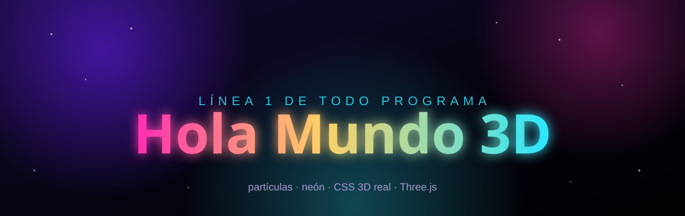

<div align="center">



### ✨ El primer programa de la historia, reinventado como si fuera 2050 ✨

**Texto 3D extruido de verdad · partículas al estilo galaxia · terminal animada · una nova de neón en cada clic**

[](https://codepdbh.github.io/hola_mundo_3D/)
&nbsp;


</div>

---

## 🪐 ¿Qué es esto?

`print("Hola, Mundo!")` lleva más de 50 años siendo la primera línea que escribe cualquier programador. Aquí le tocaba una actualización **muy** exagerada: en vez de una línea de texto plano, un **"Hola Mundo" extruido en 3D real** — con profundidad, luz de neón, un campo de partículas de fondo tipo galaxia y una terminal que va escribiendo el saludo en distintos lenguajes mientras lo mirás.

No es una captura, no es un GIF: **todo corre en vivo en tu navegador**, reacciona al cursor y explota en partículas cada vez que le hacés clic.

> **[🚀 Entrá a la demo →](https://codepdbh.github.io/hola_mundo_3D/)**

---

## 💥 Lo que vas a ver

| | |
|---|---|
| 🔤 **Tipografía extruida en 3D real** | 26 capas apiladas en el eje Z (no un truco plano) — el texto gira en el espacio y muestra su volumen real desde cualquier ángulo. |
| 🖱️ **Sigue al cursor** | El "Hola Mundo" rota en `rotateX`/`rotateY` con inercia suave, como si flotara en gravedad cero. |
| 🌌 **Fondo de galaxia con Three.js** | ~2000 partículas con blending aditivo, nebulosas flotando y un núcleo de energía en wireframe girando detrás del texto. |
| 💫 **Nova de partículas al hacer clic** | Cada clic dispara una explosión de 260 partículas, cambia la paleta de neón y suma al contador de "ejecuciones". |
| ⌨️ **Terminal con efecto máquina de escribir** | Va tipeando `print("Hola, Mundo!")` en Python, JS, C y Rust, letra por letra, con cursor parpadeante. |
| 🌍 **Portabilidad universal** | El saludo, escrito correctamente en 6 lenguajes reales: Python, JavaScript, C, Rust, Go y Java. |
| 📱 **100% responsive** | De un monitor ultrawide a un teléfono en la mano — tipografía fluida (`clamp`), reflow del layout y controles táctiles. |
| ♿ **Respeta `prefers-reduced-motion`** | Si tu sistema pide menos movimiento, la experiencia se calma automáticamente sin perder el efecto. |

---

## 🛠️ Cómo está hecho

- **Three.js** (`r128`) para el campo de partículas, las nebulosas, el núcleo wireframe y el sistema de partículas del clic — todo con `BufferGeometry` y blending aditivo, sin librerías de post-procesado.
- **CSS 3D real** (`transform-style: preserve-3d` + `translateZ` por capa) para la extrusión del texto — no es un `text-shadow` disfrazado, es geometría de verdad en el espacio 3D del navegador.
- **JavaScript puro**, sin frameworks ni build step. Un solo `index.html`, abrí y listo.
- Tipografías: [`Unbounded`](https://fonts.google.com/specimen/Unbounded) para el display, [`Sora`](https://fonts.google.com/specimen/Sora) para el cuerpo, [`Space Mono`](https://fonts.google.com/specimen/Space+Mono) para todo lo que huele a terminal.

## 🚀 Correrlo en local

No necesita instalación, ni `npm`, ni nada. Es un solo archivo HTML:

```bash
git clone https://github.com/codepdbh/hola_mundo_3D.git
cd hola_mundo_3D
```

Y abrí `index.html` en tu navegador. Eso es todo. (Si tu navegador bloquea algo por política de archivo local, serví la carpeta con cualquier servidor estático, por ejemplo `npx serve` o `python -m http.server`.)

## 🌐 Deploy

Este repo se sirve directo con **GitHub Pages** desde la rama `main`:

**👉 https://codepdbh.github.io/hola_mundo_3D/**

---

<div align="center">

Hecho con 💜 y demasiados `requestAnimationFrame`, para que nadie vuelva a ver un "Hola Mundo" aburrido.

</div>
